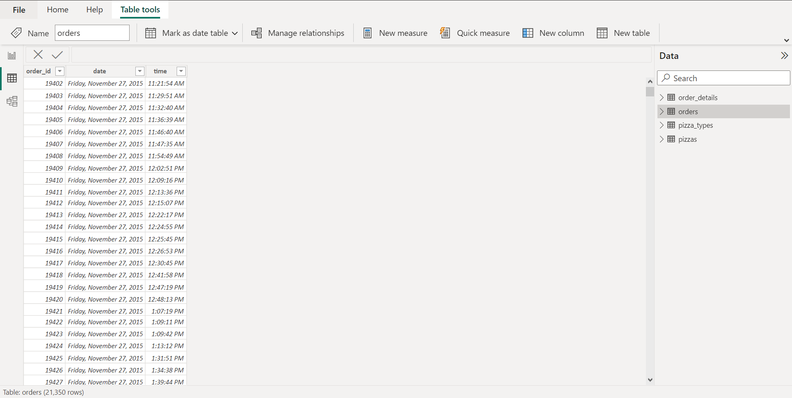

# Plato Pizza Store - 2015 Analysis

## Introduction

This is a Power BI project on sales analysis of an imaginary pizza place called **Plato's Pizza**. The project is to analyse the data provided and derive insights to answer questions asked by the owner of the business to help them make better, data-driven decisions to improve revenue.

**_Disclaimer:_** _The dataset used here and the reports generated does not represent any individual, company, institution or country; it is just an imaginary dataset to showcase things I am learning on my Data Analysis journey._

## Problem Statement

The team from Plato's Pizza reached out to me looking for ways to improve their revenue. They feel things are OK 👍 but also feel there's room for improvement.
Luckily, they have been keeping some transactional records from the previous year and want me to look into this data to give necessary insights that would guide them on the path to improving their business.
After discussions with my client (The sales team of Plato's Pizza 😆; I even have meetings with imaginary people), it was clear that they needed the following:

1. What days and times do they tend to be busiest?
2. How many pizzas are being made during peak periods?
3. What are their best and worst selling pizzas?
4. What is their average order value (AOV)?
5. How well are they utilizing their seat capacity.

## Skills/Concepts Demonstrated

In the course of this project, I was able to incorporate the following Power BI features:
- DAX
- Column from examples
- Page navigation
- Modelling
- Filters
- Data transformation

## Modelling

The automatically generated relationships were mostly okay, I just tweaked them a little to get what I needed.

Auto Model | Adjusted Model
:-----------:|:--------------:
 | 

The model is a **snowflake** schema.

I had three dimension tables (orders, pizza and pizza_type) and a fact table (order_details). I also created a measures table to store all created measures.

Minor transformations were carried out on the **pizza_type** table to get in primed for analysis.

Before Transformation | After Transformation
:---------------:|:--------------:
 | 

and on the **orders** table.

Before Transformation | After Transformation
:-----------------------:|:--------------:
 | 

## Visualisation

This report comprises of two pages:
1. Main Dashboard
2. Extended Dashboard

## Analysis

### Main Dashboard

#### Revenue
After **258 business days**, a revenue of **$817,860.05** was generated through a total of **21,350 orders**.
A divergence between the amount of orders and the revenue in the **third quarter** necessitated a deeper dive into the granular data.
Even though the highest revenue (**$73k**) orders (**1.94k**) were gotten in **July**, the first month of the third quarter, the months of **August and September** performed so badly that they negated the revenue generated in July.
In the course of making this granular research, I noticed that there was a "good" anomaly which showed a spike in orders and revenue in the month of November, right in the middle of a normally "quiet" fourth quarter. All evidence points to this being driven by the Black Friday sales.

#### Finger Licking Slice
The top selling flavour is the **Thai Chicken pizza**. While Thai Chicken still held its own as its Large came out as top seller, the **Greek XXL** tumbled to the bottom of the sales race.
Still on the size matter, the **Big Meat Small 🥩🍕** came out the crowd favourite with a whooping **1914 total sales in the year** (more on this in the extended Dashboard).
On a whole, the Larges had a high demand through the months; sadly the larger guys (XXLs) didn't have as much customer appeal; barely pulling though each month and not even being asked for in the sale booming month of July. 😢

#### Busy O'clock
Looking into the data, it was obvious that the busiest days of the week were **Thursday, Friday and Saturday**; who wouldn't want to chill after a long week... 😃
Traffic is at its peak between **12 pm and 1 pm on weekdays** (hungry lunchers come in) and between **5 pm and 6 pm through the week** (I guess, we all can't do without pizza for dinner).
Either a lot of people didn't get out of bed on time or they don't like having breakfast early 'cos on most days **9 am was a no show**.

### Dashboard Extended

#### Busy Week Huh?
**Fridays (71 order per day)** stood tall as the busiest day of the week with **Thursday (62 orders per day)** and **Saturday (61 orders per)**, following close behind.

#### The Crowd's favourite... and not so favourite
Although the Large pizzas pulled a generally large following across the board, **Big Meat's 🥩🍕 Small** definitely touched the right spots on customers' taste buds. It was ordered a whooping 1914 times, exceeding it's closest competition by a 26%.
Other honourable mentions are the **Thai Chicken Large** and the **Five Chicken Large**.
On the flip side, the **Greek XXL** (28 sold in a year) and the **Green Garden Large** (95 sold in the year) sealed the bottom of this class; it got me wondering if its a **G** thing 🤔 💭.

## Conclusion and Recommendations
With only **11.76%**  of their capacity being used, there is definitely **a whole lotta room for "improvement"**.

### Recommendation
1. They should consider using a shifting schedule that will keep only the necessary staff in during "slow" times thereby keeping costs down.
2. With the performance of the **Greek XXL**, I would strongly advice that the line be closed or, with a wave of mercy, by re-evaluated; cos in all honesty, that ship doesn't look like it likes water.
3. Consider extending the Black Friday sales, into the month of December, to ride the wave a little more 💰💰💰.
4. Since you have about four standout pizzas, consider running a promotion of sorts to make them even more appealing to the customers.
5. I would love to get more data on your customers to build profiles and patterns that can be used in making decisions on what kind of promotions would appeal to them so as to fill up the room. This data would include age, location, gender, marital status, etc. Also, I would like to get data about the cost of production of each pizzas so as to ascertain their actual profitability.

